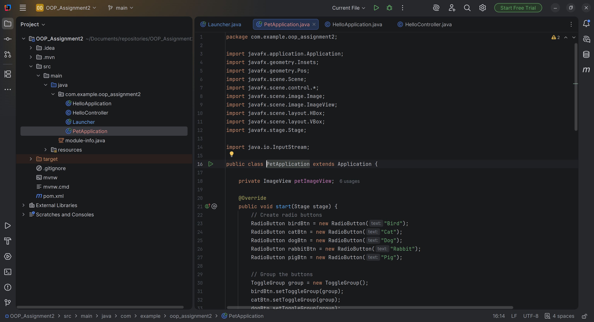
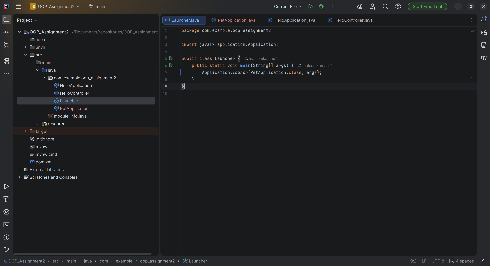
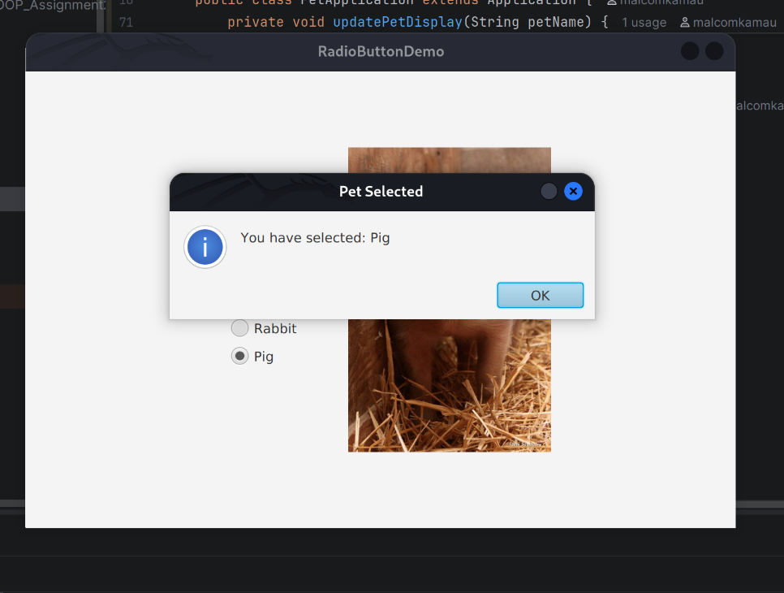
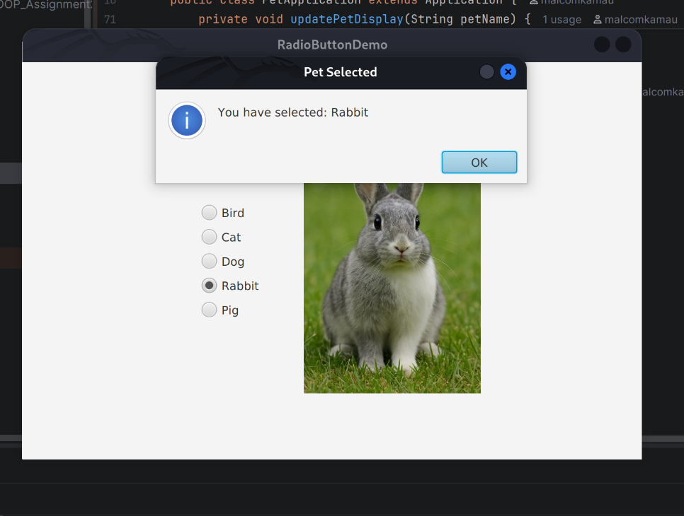

# Pet Selection JavaFX Application

A simple JavaFX application that allows users to select different pets using radio buttons and displays a corresponding image of the selected pet.

## Features

- **Interactive Selection**: Choose between Bird, Cat, Dog, Rabbit, and Pig using radio buttons.
- **Dynamic Display**: The application updates the displayed image immediately upon selection.
- **Selection Feedback**: An information alert confirms the user's choice.
- **Clean Layout**: Utilizes `VBox` and `HBox` for a responsive and organized user interface.

## Screenshots

### Main Application Code (`PetApplication.java`)


### Entry Point (`Launcher.java`)


### Application Output



## Project Structure

- `src/main/java/com/example/oop_assignment2/PetApplication.java`: The main application logic and UI definition.
- `src/main/java/com/example/oop_assignment2/Launcher.java`: Entry point for launching the JavaFX application.
- `src/main/resources/com/example/oop_assignment2/images/`: Directory containing the pet images (e.g., `dog.jpeg`, `cat.jpeg`).
- `src/main/screenshots/`: Contains screenshots of the project code.

## How to Run

1.  **Prerequisites**: Ensure you have Java 17+ and Maven installed.
2.  **Clone the project**:
    ```bash
    git clone [repository-url]
    cd OOP_Assignment2
    ```
3.  **Run the application**:
    You can run the application using Maven:
    ```bash
    mvn javafx:run
    ```
    Alternatively, if you are using an IDE like IntelliJ IDEA, you can run the `Launcher.java` or `PetApplication.java` file directly.

## Assignment Details

This project was developed as part of an Object-Oriented Programming (OOP) assignment to demonstrate proficiency in:
- JavaFX UI components (RadioButtons, ToggleGroups, ImageView).
- Event handling and property listeners.
- Resource management in Java (loading images from the classpath).
- MVC-like structure (separating launch logic from UI logic).
